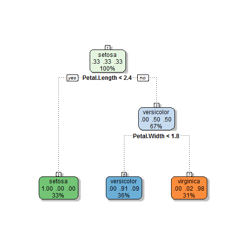

## What kind of flower do you have?

Do you ever find yourself frustrated trying to figure out the exact species of your Iris? Are you ever 'just not sure' whether you have a versicolor or a virginica? Have you ever had a customer question if there was a more scientific way for them to know what kind of iris you were selling them than just taking your word for it?

---

## Suffer no more!

With the brand new <i>Iris Species Prediction App</i> now <b>you</b> have an answer to all these problems!

Just log on to http://bcondron.shinyapps.io/App-1 and enter in the measurements of the petals and sepals of your flower. In less than a second, a sophisticated algorithm will return what type of flower you have! Never satisfied, a second opinion algorithm will check as well to make you sure you really have what you think you have!

---

## So easy anybody can use it!

The <i>Iris Species Prediction App</i> is incredibly user friendly. Your customers don't have to take your word for it anymore, since they can take the measurements themselves and put in the data. No programming or special knowledge about flowers required! Say your flower has 4.3 centimeter long sepals, 2 centimeter wide sepals, 1 centimeter long petals, and .1 centimeter wide petals. To a normal customer, this might be confusing, but our algorithms make short work of it!

---

## Our Classification Tree

 

---

## Example
Our second opinion model is too much to fit on one slide, but here's an example of how it works! You just put in the dimensions from two slides ago and voila!

```
## [1] "Our main tree thinks you have a setosa"
```

```
## [1] "Our second opinion algorithm thinks you have a setosa"
```
